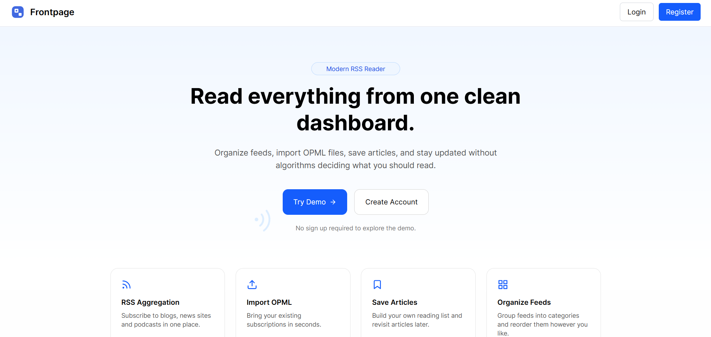
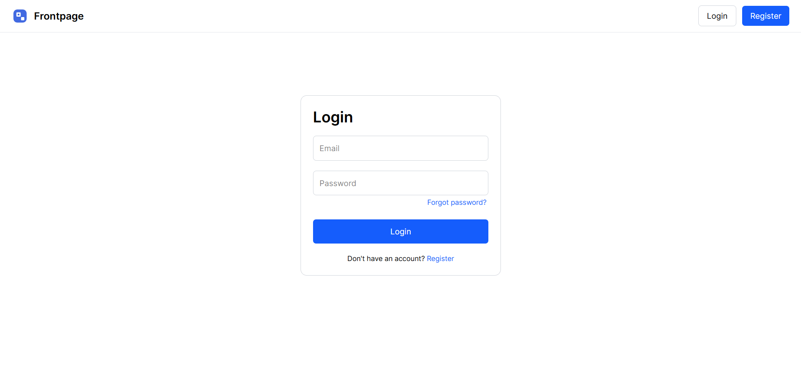
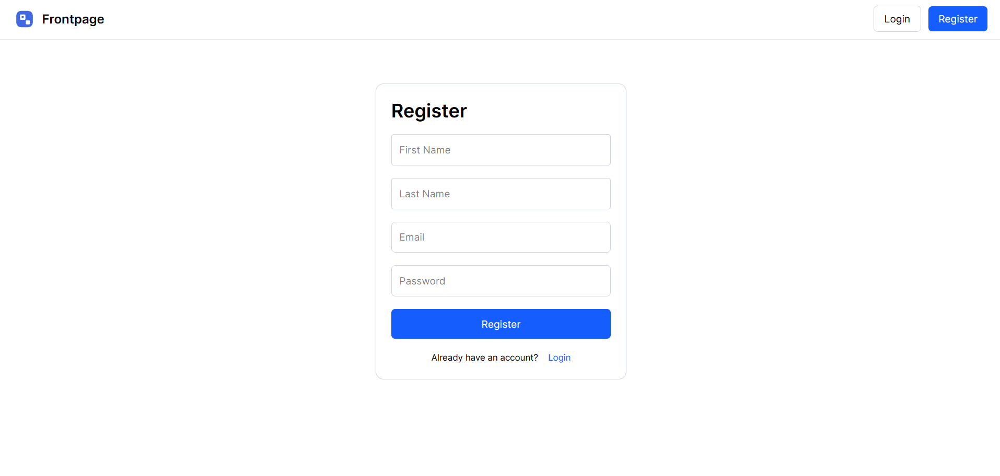
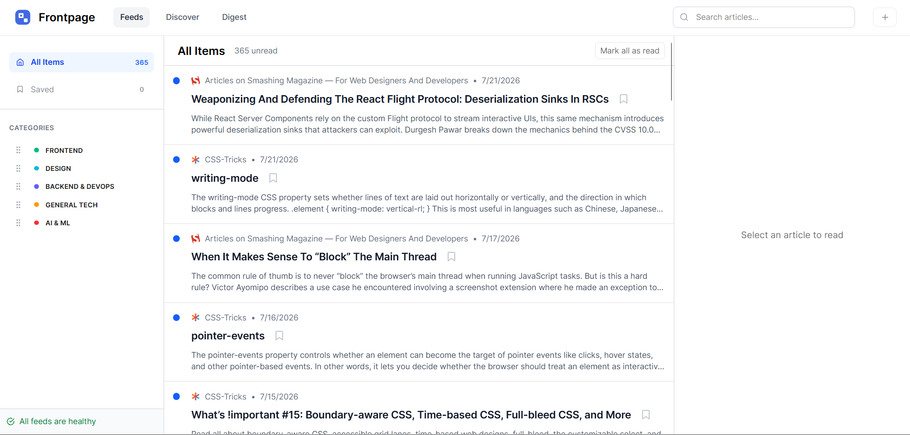
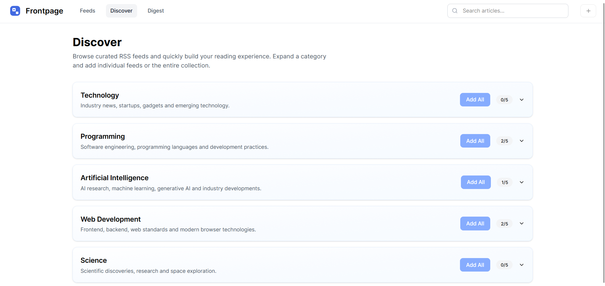
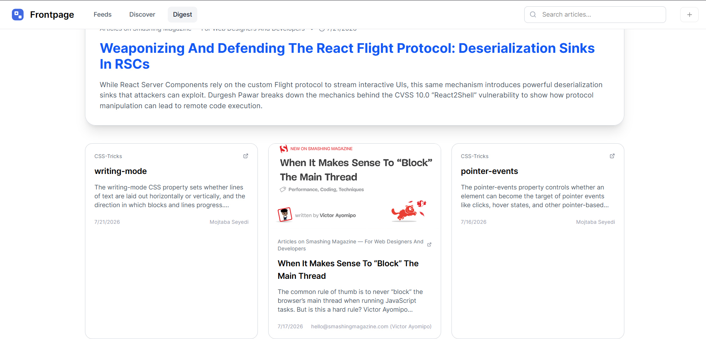

# Frontpage

A customizable content aggregator that pulls RSS and Atom feeds into a unified reading dashboard. Frontpage allows users to subscribe to their favorite feeds, organize them into categories, save articles, track reading progress, and enjoy a distraction-free reading experience.

**Live Demo:** https://frontpage-feed-reader-rss.netlify.app/

## Table of Contents

- [Screenshots](#screenshots)
- [Overview](#overview)
- [Demo Mode](#demo-mode)
- [Features](#features)
- [Tech Stack](#tech-stack)
- [Architecture](#architecture)
- [Design Decisions](#design-decisions)
  - [Content Discovery](#content-discovery--onboarding)
  - [Digest & Reading Experience](#digest--reading-experience)
  - [Layout & Organization](#layout--organization)
  - [Search Experience](#search-experience)
  - [Additional Design Decisions](#additional-design-decisions)
- [Development Journey](#development-journey)
  - [Initial Approach vs Final Architecture](#initial-approach-vs-final-architecture)
  - [Major Refactors](#major-refactors)
  - [Challenges](#challenges)
  - [Development Timeline](#development-timeline)
- [AI Collaboration Reflection](#ai-collaboration-reflection)
- [Project Differentiators](#project-differentiators)
- [Self Assessment](#self-assessment)
- [Known Limitations](#known-limitations)
- [Future Improvements](#future-improvements)
- [Running Locally](#running-locally)
- [Environment Variables](#environment-variables)
- [Acknowledgments](#acknowledgments)

---

## Screenshots

<table>
  <tr>
    <td></td>
    <td></td>
    <td></td>
  </tr>
  <tr>
    <td></td>
    <td></td>
    <td></td>
  </tr>
</table>

# Overview

Frontpage is a modern RSS reader that aggregates content from multiple RSS and Atom feeds into a single, clean reading experience.

Instead of visiting multiple websites individually, users can manage subscriptions, organize feeds into categories, save articles, mark articles as read, and browse content through a responsive reading interface.

The project focuses on creating a polished reading experience while maintaining a scalable architecture that separates UI, business logic, backend services, and data persistence.

---

# Demo Mode

Frontpage includes a Demo Mode that allows visitors to explore the application without creating an account.

Demo Mode provides a curated collection of RSS feeds, sample articles, and the complete reading experience, making it easy to evaluate the product immediately.

Once a user signs in, Demo Mode is automatically disabled and the application switches to the user's personal subscriptions, saved articles, and reading history. This keeps demonstration data completely separate from user data.

---

## Features

- User authentication
- Demo mode for guest users
- Discover page
- Daily Digest
- Feed management (Create, Edit, Delete)
- RSS & Atom feed parsing
- Real-time article search
- Feed categorization
- OPML import with Error Handling
- Dedicated reader view
- Saved articles
- Read / unread tracking
- Automatic favicon generation
- Rich HTML article rendering
- Responsive design
- Loading skeletons
- Secure HTML sanitization
- Feed validation
- Error handling
- Modular architecture

---

# Tech Stack

| Layer             | Technology          |
| ----------------- | ------------------- |
| Frontend          | React 19 + Vite     |
| Backend           | Node.js + Express   |
| Database          | Supabase PostgreSQL |
| Authentication    | Supabase Auth       |
| Styling           | Tailwind CSS        |
| RSS Parsing       | rss-parser          |
| HTTP Client       | Axios               |
| HTML Sanitization | DOMPurify           |
| Icons             | React Icons         |
| Frontend Hosting  | Netlify             |
| Backend Hosting   | Render              |

---

# Architecture

```text
React Frontend
│
├── Pages
├── Components
├── Hooks
├── Services
│
▼

Express Backend
│
├── Controllers
├── Routes
├── RSS Service
│
▼

RSS / Atom Feeds

▼

Supabase

├── Authentication
├── Feeds
├── Saved Articles
└── Read Status
```

The project follows a layered architecture that separates UI rendering from business logic and external services.

---

# Design Decisions

## Content Discovery

### Problem

New users often start with an empty dashboard, making it difficult to experience the value of an RSS reader immediately.

### Solution

Frontpage includes a dedicated **Discover** section where users can browse and subscribe to curated feeds across multiple categories. Users can also manually add feeds or import existing subscriptions using OPML or JSON.

To reduce friction for first-time visitors, Frontpage includes a Demo Mode with curated sample feeds alongside manual feed creation and OPML/JSON import. This allows users to experience the application immediately before deciding to create an account.

### Why

This provides both experienced RSS users and newcomers with a quick way to build a personalized reading experience without hunting for feed URLs.

### Future Improvements

- Personalized recommendations based on subscriptions
- Trending feeds
- Search across the discovery catalog

---

## Digest & Reading Experience

### Problem

Following many feeds can make it difficult to identify important or recent content.

### Solution

Frontpage includes a **Daily Digest** that aggregates recent articles into a concise overview, giving users a quick snapshot of new content across all subscribed feeds before diving into individual articles.

### Why

The digest reduces information overload and helps users prioritize what to read first.

### Future Improvements

- AI-generated summaries
- Topic clustering
- Reading time estimates
- Personalized digest ordering

---

## Layout & Organization

### Problem

Users browse content differently depending on screen size and reading habits.

### Solution

The application separates browsing and reading into reusable interface components.

- Sidebar
- Feed List
- Article List
- Reader
- Search
- Toolbar

### Why

This allows components to remain reusable while keeping the reading experience uncluttered.

### Future Improvements

- Density controls
- Theme customization
- Typography controls
- Adjustable sidebar width

---

## Search Experience

### Problem

As subscriptions grow, browsing manually becomes inefficient. Users need a fast way to locate articles without navigating through every feed.

### Solution

Frontpage includes a real-time search bar that filters articles instantly as users type. Search works across the aggregated article list, making it easy to find content regardless of which feed it originated from.

### Why

A unified search experience complements the aggregated nature of the application and significantly reduces the time required to find previously seen or newly published articles.

### Future Improvements

- Search by author
- Search by feed
- Search by category
- Date filtering
- Search history

## Additional Design Decisions

- Reader optimized for long-form content
- DOMPurify sanitization before rendering HTML
- Automatic image fallback
- Persistent read status
- Persistent saved articles
- Responsive layouts
- Skeleton loading components
- Modular service architecture

---

# Development Journey

## Initial Approach vs Final Architecture

The project originally began as a basic RSS reader capable of displaying articles from manually entered feeds.

As development progressed it evolved into a complete application featuring:

- Authentication
- Persistent subscriptions
- Feed CRUD
- Dedicated backend
- OPML import with error handling
- Saved articles
- Read tracking
- Responsive layouts
- Modular hooks
- Service layer abstraction

Business logic gradually moved out of UI components into reusable services and custom hooks.

---

## Major Refactors

Several architectural decisions changed during development.

### RSS Backend

Originally RSS parsing happened closer to the frontend.

The project now uses a dedicated Express backend responsible for:

- Feed validation
- RSS parsing
- Normalization
- Error handling

---

### Component Architecture

Large page components were gradually split into reusable components.

Example:

```text
Dashboard

├── DashboardHeader
├── Sidebar
├── FeedList
├── ArticleList
├── ReaderContent
├── SearchBar
└── AddFeedMenu
```

---

### State Management

Logic for:

- Saved Articles
- Read Status
- Feed Loading

was extracted into reusable custom hooks.

---

# Challenges

The most technically challenging areas were:

- RSS vs Atom differences
- Missing metadata
- Different image formats
- HTML sanitization
- Deployment configuration
- Feed validation
- Responsive reading layouts

RSS feeds vary significantly across publishers which required extensive normalization before rendering.

---

## Development Timeline

| Session | Focus             | Progress                                      |
| ------- | ----------------- | --------------------------------------------- |
| 1       | Foundation        | React setup, Supabase authentication, routing |
| 2       | Feed Management   | CRUD operations, validation, categories       |
| 3       | Backend           | Express API, RSS parsing, normalization       |
| 4       | Reader Experience | Reader view, saved articles, read tracking    |
| 5       | Polish            | Skeletons, imports, deployment, refactoring   |

---

# AI Collaboration Reflection

## How AI Was Used

AI was used as a development assistant for:

- Architecture discussions
- Debugging
- Refactoring
- Component organization
- Backend troubleshooting
- Deployment debugging
- UX improvements

## What Worked Well

AI accelerated debugging and code reviews while helping identify opportunities for better separation of concerns.

## What I Learned

The project reinforced the importance of:

- Modular architecture
- Service abstraction
- Custom hooks
- API normalization
- Clean component boundaries

## Where I Pushed Back

Not every suggestion was accepted.

Recommendations were evaluated based on maintainability and consistency with the project's architecture.

---

# Project Differentiators

## Dedicated Reading Experience

Unlike many RSS readers that prioritize feed management, Frontpage focuses heavily on the reading experience.

### Highlights

- Rich HTML rendering
- Responsive typography
- Image fallback
- Secure HTML sanitization
- Persistent reading progress

### Impact

Reading articles feels closer to visiting the original publication while maintaining consistency across every feed.

## Unified Search

RSS readers often separate content by feed, making articles harder to rediscover. I wanted search to work across the entire reading experience.

### How it enhances the product

Users can instantly locate articles from any subscribed feed without remembering where they were originally published.

### Implementation Highlights

- Real-time filtering
- Search across aggregated articles
- Immediate results while typing
- Integrated with the main reading dashboard

Designing search around the aggregated article list creates a more natural browsing experience than restricting searches to individual feeds.

---

## Strengths

- Clean architecture
- Modular components
- Responsive UI
- Reusable hooks
- Strong separation of concerns
- Robust RSS parsing
- Scalable backend

## Areas for Improvement

- AI summaries
- Offline support
- Better search
- Keyboard shortcuts
- Reader customization

---

# Known Limitations

- Feed quality depends on the publisher.
- Some publishers limit automated requests.
- Full article content is only available when included in the RSS feed.
- Offline reading is not currently supported.
- Feed discovery is currently manual.

---

# Future Improvements

- AI generated daily digest
- Feed recommendations
- Discover page
- Reading statistics
- Keyboard shortcuts
- OPML export
- Offline caching
- Themes
- Reader customization
- Reading time estimation
- Smart collections
- Tags
- Full-text search

---

# Running Locally

```bash
# Clone repository
git clone https://github.com/mmuneeb1000/frontpage-feed-reader-rss

cd frontpage

# Install frontend dependencies
npm install

# Install backend dependencies
cd server
npm install

# Configure environment variables
cp .env.example .env

# Start frontend
npm run dev

# Start backend
npm run server
```

---

# Environment Variables

| Variable                 | Description                   |
| ------------------------ | ----------------------------- |
| `VITE_SUPABASE_URL`      | Supabase project URL          |
| `VITE_SUPABASE_ANON_KEY` | Supabase anonymous key        |
| `VITE_API_URL`           | Backend API URL               |
| `PORT`                   | Express server port           |
| `FRONTEND_URL`           | Frontend origin used for CORS |

---

## Author

M.Muneeb

- Frontend Mentor - https://www.frontendmentor.io/profile/mmuneeb1000
- GitHub - https://github.com/mmuneeb1000
- LinkedIn - https://www.linkedin.com/in/m-muneeb-a9984633b/

---

# Acknowledgments

Built as part of the Frontend Mentor Product Challenge.

The project uses publicly available RSS and Atom feeds for demonstration and testing purposes.
